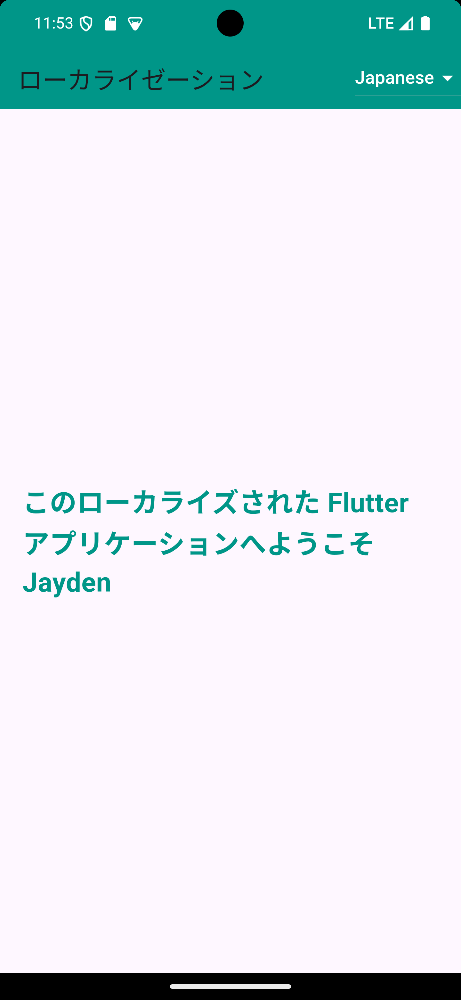
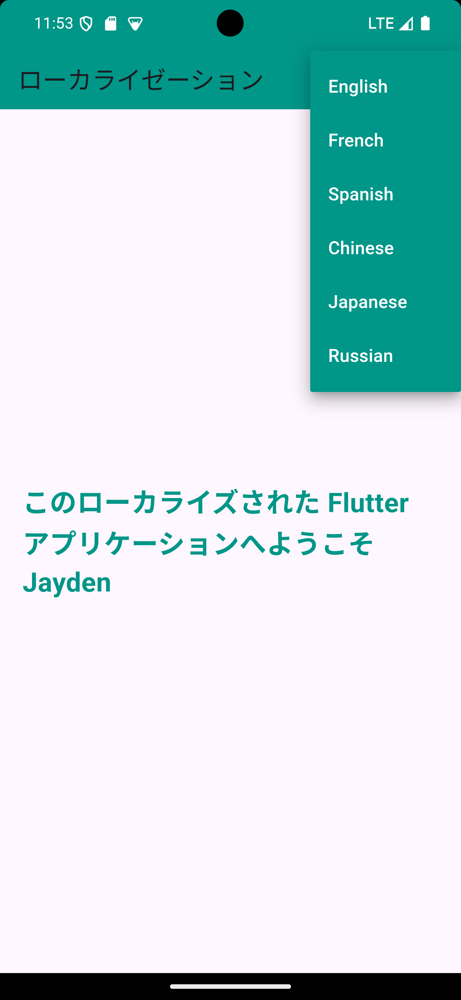
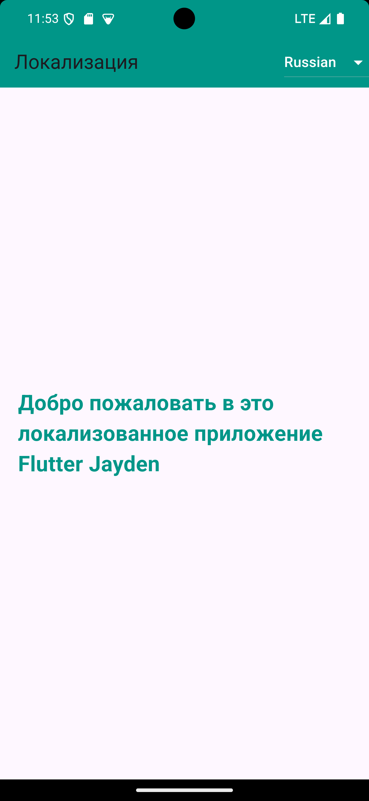

# Global Speak

## À Propos du Projet

Global Speak est une application mobile développée en Flutter, conçue pour offrir une interface multilingue et intuitive. L'application détecte automatiquement la langue par défaut de l'appareil de l'utilisateur et permet de changer facilement de langue via un menu déroulant dans l'AppBar. Cette fonctionnalité permet aux utilisateurs de naviguer dans l'application dans leur langue préférée.

## Fonctionnalités Clés

- **Détection Automatique de la Langue :** L'application configure automatiquement l'interface utilisateur dans la langue par défaut de l'appareil de l'utilisateur.
- **Changement de Langue :** Les utilisateurs peuvent changer la langue de l'application à tout moment en utilisant le menu déroulant dans l'AppBar.
- **Langues Disponibles :**  L'application prend en charge l'anglais, le français, l'espagnol, le chinois, le japonais et le russe.

## Dépendances Externes

- `flutter_localization` pour gérer la localisation et la traduction des textes dans l'application.

Cette dépendance sera automatiquement installée lors de l'exécution de la commande `flutter pub get`.

## Technologies Utilisées

- **Framework :** Flutter
- **Langage :** Dart

## Installation

### Prérequis

- Flutter doit être installé sur votre machine. Pour plus d'informations, consultez la documentation officielle de Flutter : [Installation Flutter](https://flutter.dev/docs/get-started/install)

### Cloner le projet depuis GitHub :
```
https://github.com/barseille/Global_Speak.git
```

### Installer les dépendances :
```
flutter pub get
```

### Exécuter l'application :

Lancez l'application sur un émulateur ou un appareil réel :
```
flutter run
```

## Structure du Projet

- **lib/main.dart :** Le point d'entrée de l'application. Initialise l'application et configure la localisation.
- **lib/pages/home_page.dart :** La page d'accueil de l'application avec la possibilité de changer de langue.
- **lib/localization/locales.dart :**  Fichier de configuration des langues supportées et des traductions.

## Captures d'écran


<p align="center">
  
  
  
</p>